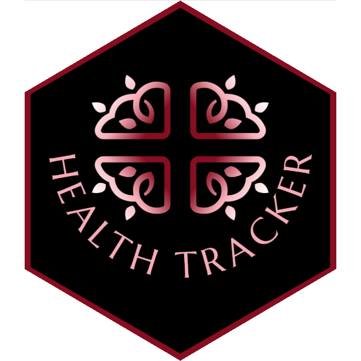

# Health Tracker

A Shiny app with Python for tracking health data.

The idea is to be able to record on a daily basis various numbers and slowly build out some models to predict things.

More to come.
